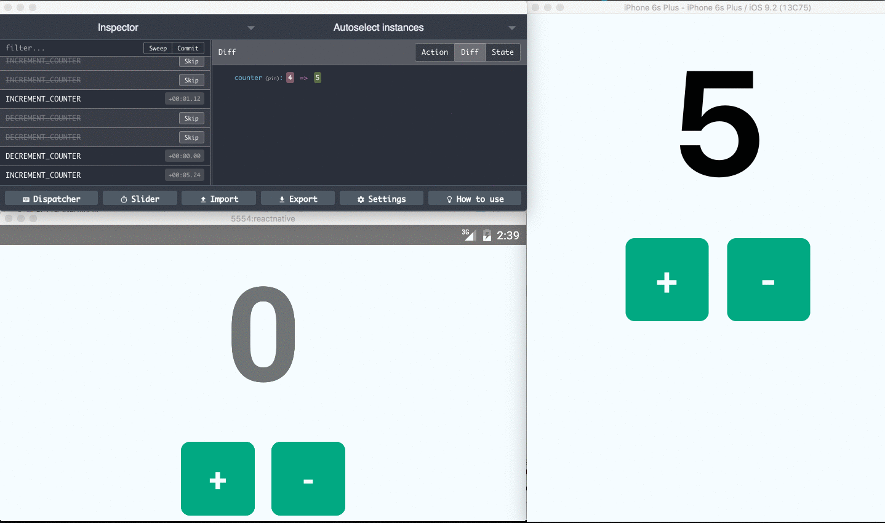

# Remote Redux DevTools



Use [Redux DevTools](https://github.com/reduxjs/redux-devtools) remotely for React Native, hybrid, desktop and server side Redux apps.

### Installation

```
yarn add @redux-devtools/remote
```

### Usage

There are 2 ways of usage depending if you're using other store enhancers (middlewares) or not.

#### Add DevTools enhancer to your store

If you have a basic [store](http://redux.js.org/docs/api/createStore.html) as described in the official [redux-docs](http://redux.js.org/index.html), simply replace:

```javascript
import { createStore } from 'redux';
const store = createStore(reducer);
```

with

```javascript
import { createStore } from 'redux';
import { devToolsEnhancer } from '@redux-devtools/remote';
const store = createStore(reducer, devToolsEnhancer());
// or const store = createStore(reducer, preloadedState, devToolsEnhancer());
```

> Note: passing enhancer as last argument requires redux@>=3.1.0

#### When to use DevTools compose helper

If you setup your store with [middlewares and enhancers](http://redux.js.org/docs/api/applyMiddleware.html) like [redux-saga](https://github.com/redux-saga/redux-saga) and similar, it is crucial to use `composeWithDevTools` export. Otherwise, actions dispatched from Redux DevTools will not flow to your middlewares.

In that case change this:

```javascript
import { createStore, applyMiddleware, compose } from 'redux';

const store = createStore(
  reducer,
  preloadedState,
  compose(
    applyMiddleware(...middleware)
    // other store enhancers if any
  )
);
```

to:

```javascript
import { createStore, applyMiddleware } from 'redux';
import { composeWithDevTools } from '@redux-devtools/remote';

const store = createStore(
  reducer,
  /* preloadedState, */ composeWithDevTools(
    applyMiddleware(...middleware)
    // other store enhancers if any
  )
);
```

or with devTools' options:

```javascript
import { createStore, applyMiddleware } from 'redux';
import { composeWithDevTools } from '@redux-devtools/remote';

const composeEnhancers = composeWithDevTools({ realtime: true, port: 8000 });
const store = createStore(
  reducer,
  /* preloadedState, */ composeEnhancers(
    applyMiddleware(...middleware)
    // other store enhancers if any
  )
);
```

### Enabling

In order not to allow it in production by default, the enhancer will have effect only when `process.env.NODE_ENV === 'development'`.

For Webpack you should add it as following (`webpack.config.dev.js`):

```js
// ...
plugins: [
  new webpack.DefinePlugin({
    'process.env.NODE_ENV': JSON.stringify('development')
  })
],
// ...
```

In case you don't set `NODE_ENV`, you can set `realtime` parameter to `true` or to other global variable to turn it off in production:

```js
const store = createStore(reducer, devToolsEnhancer({ realtime: true }));
```

### Monitoring

Use one of our monitor apps to inspect and dispatch actions:

- [redux-devtools-extension](https://github.com/reduxjs/redux-devtools/tree/main/extension) - Click "Remote" button (or press [`Cmd+Ctrl+Arrow up`](https://github.com/zalmoxisus/redux-devtools-extension#keyboard-shortcuts)) to open remote monitoring.
- [remotedev-rn-debugger](https://github.com/jhen0409/remotedev-rn-debugger) - Used in React Native debugger as a dock monitor.
- [atom-redux-devtools](https://github.com/zalmoxisus/atom-redux-devtools) - Used in Atom editor.
- [redux-dispatch-cli](https://github.com/jhen0409/redux-dispatch-cli) - A CLI tool for Redux remote dispatch.
- [vscode-redux-devtools](https://github.com/jkzing/vscode-redux-devtools) - Used in Visual Studio Code.

Use [@redux-devtools/app](https://github.com/reduxjs/redux-devtools/tree/main/packages/redux-devtools-app) to create your own monitor app.

### Communicate via local server

Use [@redux-devtools/cli](https://github.com/reduxjs/redux-devtools/tree/main/packages/redux-devtools-cli).
You can import it in your `server.js` script and start remotedev server together with your development server:

```js
var reduxDevTools = require('@redux-devtools/cli');
reduxDevTools({ hostname: 'localhost', port: 8000 });
```

See [@redux-devtools/cli](https://github.com/reduxjs/redux-devtools/tree/main/packages/redux-devtools-cli) for more details.
For React Native you can use [remotedev-rn-debugger](https://github.com/jhen0409/remotedev-rn-debugger), which already include `@redux-devtools/cli`.

### Parameters

| Name                    | Description                                                                                                                                                                                                                                                                                                   |
| ----------------------- | ------------------------------------------------------------------------------------------------------------------------------------------------------------------------------------------------------------------------------------------------------------------------------------------------------------- |
| `name`                  | _String_ representing the instance name to be shown on the remote monitor.                                                                                                                                                                                                                                    |
| `realtime`              | _Boolean_ specifies whether to allow remote monitoring. By default is `process.env.NODE_ENV === 'development'`.                                                                                                                                                                                               |
| `hostname`              | _String_ used to specify host for [@redux-devtools/cli](https://github.com/reduxjs/redux-devtools/tree/main/packages/redux-devtools-cli). If `port` is specified, default value is `localhost`.                                                                                                               |
| `port`                  | _Number_ used to specify host's port for [@redux-devtools/cli](https://github.com/reduxjs/redux-devtools/tree/main/packages/redux-devtools-cli).                                                                                                                                                              |
| `secure`                | _Boolean_ specifies whether to use `https` protocol for [@redux-devtools/cli](https://github.com/reduxjs/redux-devtools/tree/main/packages/redux-devtools-cli).                                                                                                                                               |
| `maxAge`                | _Number_ of maximum allowed actions to be stored on the history tree, the oldest actions are removed once maxAge is reached. Default is `30`.                                                                                                                                                                 |
| `actionsDenylist`       | _array_ of actions to be hidden in DevTools. Overwrites corresponding global setting in the options page. See the example bellow.                                                                                                                                                                             |
| `actionsAllowlist`      | _array_ of actions to be shown. All other actions will be hidden in DevTools.                                                                                                                                                                                                                                 |
| `actionSanitizer`       | _Function_ which takes action object and id number as arguments, and should return action object back. See the example bellow.                                                                                                                                                                                |
| `stateSanitizer`        | _Function_ which takes state object and index as arguments, and should return state object back. See the example bellow.                                                                                                                                                                                      |
| `startOn`               | _String_ or _Array of strings_ indicating an action or a list of actions, which should start remote monitoring (when `realtime` is `false`).                                                                                                                                                                  |
| `stopOn`                | _String_ or _Array of strings_ indicating an action or a list of actions, which should stop remote monitoring.                                                                                                                                                                                                |
| `sendOn`                | _String_ or _Array of strings_ indicating an action or a list of actions, which should trigger sending the history to the monitor (without starting it). _Note_: when using it, add a `fetch` polyfill if needed.                                                                                             |
| `sendOnError`           | _Numeric_ code: `0` - disabled (default), `1` - send all uncaught exception messages, `2` - send only reducers error messages.                                                                                                                                                                                |
| `sendTo`                | _String_ url of the monitor to send the history when `sendOn` is triggered. By default is `${secure ? 'https' : 'http'}://${hostname}:${port}`.                                                                                                                                                               |
| `actionCreators`        | _Array_ or _Object_ of action creators to dispatch remotely. See [the example](https://github.com/zalmoxisus/remote-redux-devtools/commit/b54652930dfd4e057991df8471c343957fd7bff7).                                                                                                                          |
| `shouldHotReload`       | _Boolean_ - if set to `false`, will not recompute the states on hot reloading (or on replacing the reducers). Default to `true`.                                                                                                                                                                              |
| `shouldRecordChanges`   | _Boolean_ - if specified as `false`, it will not record the changes till clicked on "Start recording" button on the monitor app. Default is `true`.                                                                                                                                                           |
| `shouldStartLocked`     | _Boolean_ - if specified as `true`, it will not allow any non-monitor actions to be dispatched till `lockChanges(false)` is dispatched. Default is `false`.                                                                                                                                                   |
| `id`                    | _String_ to identify the instance when sending the history triggered by `sendOn`. You can use, for example, user id here, to know who sent the data.                                                                                                                                                          |
| `suppressConnectErrors` | _Boolean_ - if set to `false`, all socket errors thrown while trying to connect will be printed to the console, regardless of if they've been thrown before. This is primarily for suppressing `SocketProtocolError` errors, which get repeatedly thrown when trying to make a connection. Default is `true`. |

All parameters are optional. You have to provide the `port` property to use the `hostname` or `secure` properties.

Example:

```js
export default function configureStore(preloadedState) {
  const store = createStore(
    reducer,
    preloadedState,
    devToolsEnhancer({
      name: 'Android app',
      realtime: true,
      hostname: 'localhost',
      port: 8000,
      maxAge: 30,
      actionsDenylist: ['EFFECT_RESOLVED'],
      actionSanitizer: (action) =>
        action.type === 'FILE_DOWNLOAD_SUCCESS' && action.data
          ? { ...action, data: '<<LONG_BLOB>>' }
          : action,
      stateSanitizer: (state) =>
        state.data ? { ...state, data: '<<LONG_BLOB>>' } : state,
    })
  );
  return store;
}
```

### Demo

- [Toggle monitoring](http://zalmoxisus.github.io/monitoring/)

### Examples

- [Web](https://github.com/reduxjs/redux-devtools/tree/main/packages/redux-devtools-remote/examples)
- [React Native](https://github.com/chentsulin/react-native-counter-ios-android)

### License

MIT
