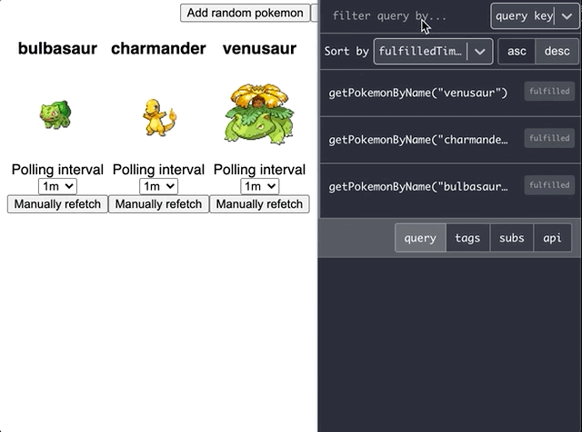

# Redux DevTools RTK Query inspector monitor

A monitor that displays [RTK query](https://redux-toolkit.js.org/rtk-query/overview) queries and mutations for [Redux DevTools](https://github.com/gaearon/redux-devtools).

Created by [FaberVitale](https://github.com/FaberVitale)

## Demo

- [link](https://rtk-query-monitor-demo.netlify.app/)
- [demo source](https://github.com/FaberVitale/redux-devtools/tree/feat/rtk-query-monitor/packages/redux-devtools-rtk-query-inspector-monitor/demo)

## Preview



## Installation

### npm

```bash
npm i @redux-devtools/rtk-query-inspector-monitor --save
```

### yarn

```bash
yarn add @redux-devtools/rtk-query-inspector-monitor
```


## Usage

You can use `RtkQueryInspectorMonitor` as the only monitor in your app:

##### `containers/DevTools.js`

```ts
import React from 'react';
import { createDevTools } from '@redux-devtools/core';
import RtkQueryInspectorMonitor from '@redux-devtools/rtk-query-inspector-monitor';

export default createDevTools(<RtkQueryInspectorMonitor />);
```

Then you can render `<DevTools>` to any place inside app or even into a separate popup window.

Alternatively, you can use it together with [`DockMonitor`](https://github.com/reduxjs/redux-devtools/tree/master/packages/redux-devtools-dock-monitor) to make it dockable.  

See also

- [`DockMonitor` README](https://github.com/reduxjs/redux-devtools/tree/master/packages/redux-devtools-dock-monitor)

- [Read how to start using Redux DevTools.](https://github.com/reduxjs/redux-devtools)

- [Redux Devtools walkthrough](https://github.com/reduxjs/redux-devtools/tree/master/docs/Walkthrough.md)


## Features

- sorts queries in ascending or descending order by:
    - fulfilledTimeStamp
    - query key
    - query status
    - endpoint
    - api reducerPath
- filters queries by:
    - fulfilledTimeStamp
    - query key
    - query status
    - endpoint
    - api reducerPath
- displays
    - status flags
    - query state
    - tags
    - subscriptions
    - api slice config

## TODO

- [ ] display mutations
- [ ] filter by tags types
- [ ] download query.data
- [ ] upload query.data(?)
- [ ] refetch query button(?)
- ...suggestions are welcome


## Redux DevTools props

| Name          | Description                                                                                                                                                                                                                                                                                                                         |
| ------------- | ----------------------------------------------------------------------------------------------------------------------------------------------------------------------------------------------------------------------------------------------------------------------------------------------------------------------------------- |
| `theme`       | Either a string referring to one of the themes provided by [redux-devtools-themes](https://github.com/gaearon/redux-devtools-themes) (feel free to contribute!) or a custom object of the same format. Optional. By default, set to [`'nicinabox'`](https://github.com/gaearon/redux-devtools-themes/blob/master/src/nicinabox.js). |
| `invertTheme` | Boolean value that will invert the colors of the selected theme. Optional. By default, set to `false`                                                                                                                                                                                                                               |

<br/>

### Development

[running the demo](./demo/README.md)

<br/>

## License

[MIT](./LICENSE.md)
